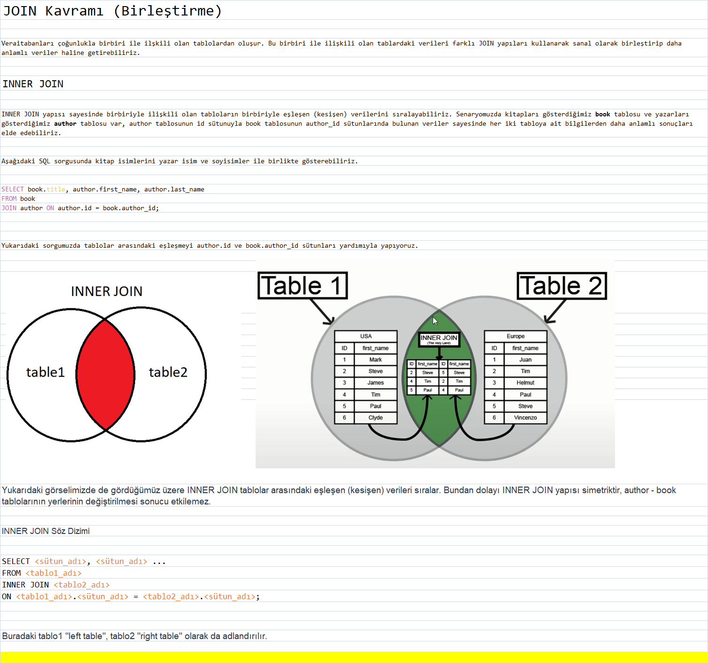
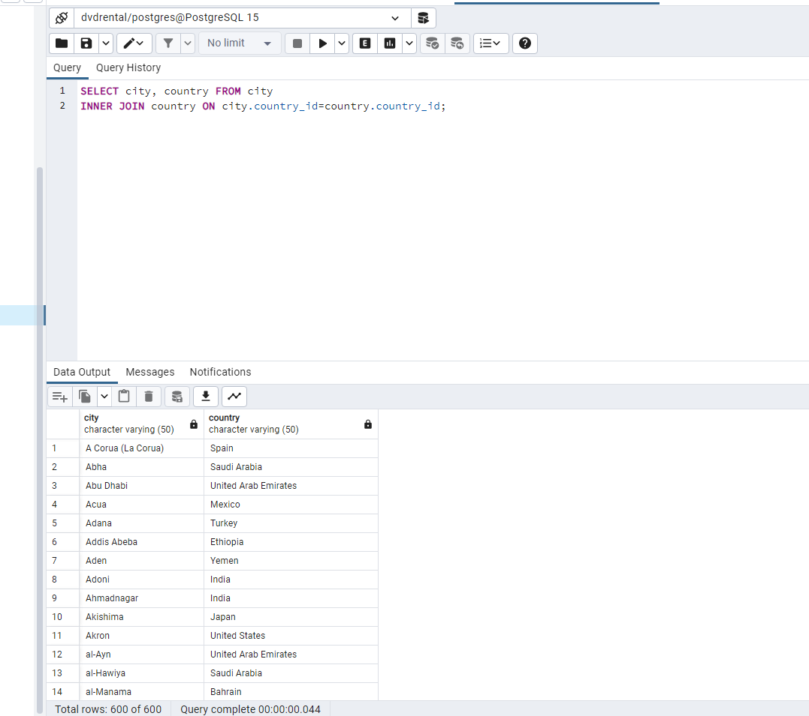
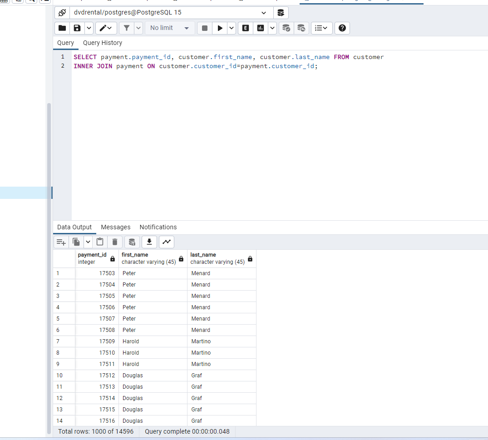
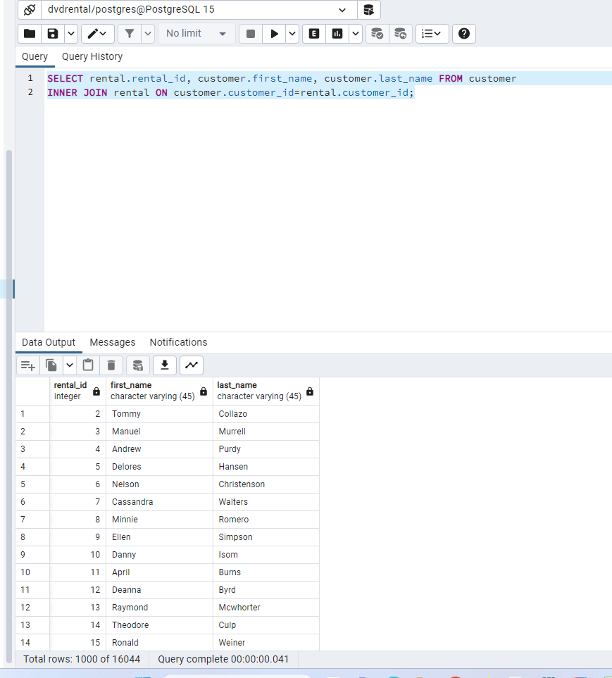

-- city tablosu ile country tablosunda bulunan şehir (city) ve ülke (country) isimlerini birlikte görebileceğimiz INNER JOIN sorgusunu yazınız.

SELECT city, country FROM city
INNER JOIN country ON city.country_id=country.country_id;

[img_1.png](img_1.png)

-- customer tablosu ile payment tablosunda bulunan payment_id ile customer tablosundaki first_name ve last_name isimlerini birlikte görebileceğimiz INNER JOIN sorgusunu yazınız.

SELECT payment.payment_id, customer.first_name, customer.last_name FROM customer
INNER JOIN payment ON customer.customer_id=payment.customer_id;

[img_2.png](img_2.png)

-- customer tablosu ile rental tablosunda bulunan rental_id ile customer tablosundaki first_name ve last_name isimlerini birlikte görebileceğimiz INNER JOIN sorgusunu yazınız.
SELECT rental.rental_id, customer.first_name, customer.last_name FROM customer
INNER JOIN rental ON customer.customer_id=rental.customer_id;

[img_3.png](img_3.png)

